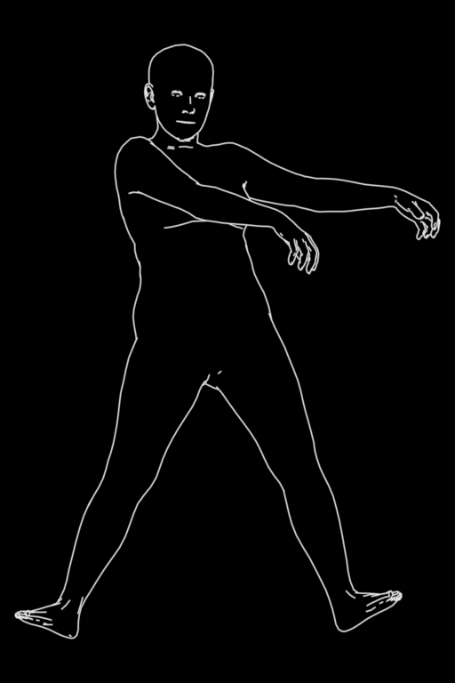
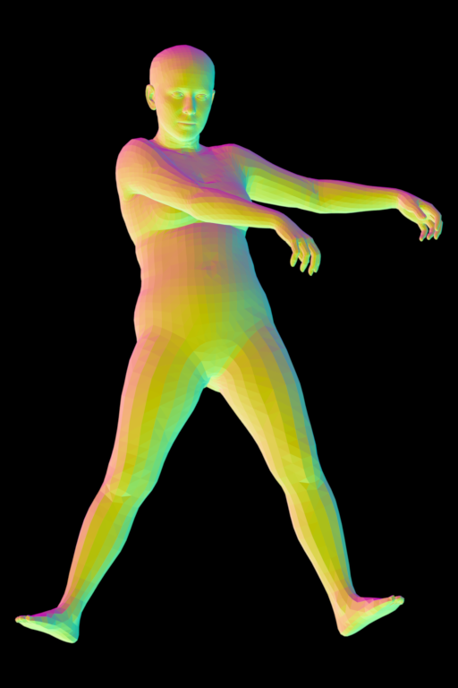
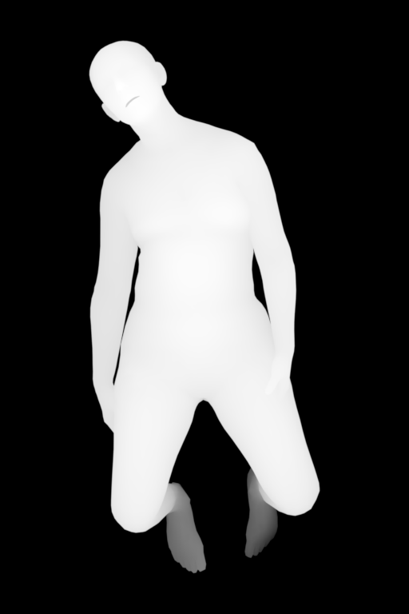

# openpose_depth_generator

Windows pipeline for turning OpenPose bone-structure images and keypoint JSON files into SMPL-X depth, lineart and normal renders.

The repository contains the pipeline code, Blender render script and documentation. It does not include licensed body models, VPoser checkpoints, generated SMPL-X meshes, PKL parameter files or local datasets.

## Results

| Depth | Lineart | Normal |
| --- | --- | --- |
|  |  |  |

Additional complex-pose example:



## Requirements

- Windows
- Python 3.12
- Blender 5.1
- Git with submodule support
- CUDA-capable PyTorch setup recommended for SMPLify-X fitting
- Licensed/private assets downloaded separately:
  - SMPL-X model files such as `SMPLX_FEMALE.npz`, `SMPLX_MALE.npz`, `SMPLX_NEUTRAL.npz`
  - VPoser checkpoint files
  - `human_body_prior` package/checkpoints

The SMPL-X and VPoser assets have their own licenses and redistribution rules. Do not commit them to this repository.

## Setup

Clone with the SMPLify-X fork:

```powershell
git clone --recurse-submodules https://github.com/palbiez/openpose_depth_generator.git
cd openpose_depth_generator
git submodule update --init --recursive
```

Create and activate a Python 3.12 environment, then install the Python dependencies:

```powershell
py -3.12 -m venv .venv
.\.venv\Scripts\Activate.ps1
python -m pip install --upgrade pip
pip install -r requirements.txt
```

Install `human_body_prior` and PyTorch according to your local CUDA/CPU setup. Blender modules such as `bpy`, `bmesh` and `mathutils` are supplied by Blender, not pip.

Expected private/local layout:

```text
dataset/
|-- keypoints-18/
|-- keypoints/
|-- images/
|-- poses_normal/
|-- poses_complex/
|-- rendered/
|-- vposer/
`-- smplx/
```

Only lightweight dataset documentation and placeholder files are tracked by Git. Local source images, keypoints, rendered PNGs, SMPL-X models, VPoser checkpoints and fitted outputs are ignored.

## Configuration

The pipeline can be driven by command-line options or a JSON config.

Copy the example:

```powershell
Copy-Item .\config\pipeline.example.json .\config\pipeline.json
```

Edit local paths in `config/pipeline.json`, especially:

- `python_exe`
- `blender_exe`
- `use_cuda`
- `render_output_root`

Run with config:

```powershell
py -3 .\run_full_pipeline.py --config .\config\pipeline.json
```

Command-line arguments override config values.

## Pipeline

1. Convert OpenPose BODY_18 JSON files to BODY_25:

   ```powershell
   py -3 .\tools\convert_18_to_25_and_normalize.py
   ```

2. Flatten nested OpenPose source folders:

   ```powershell
   py -3 .\tools\flatten_dataset.py
   ```

3. Route files into normal and complex fitting batches:

   ```powershell
   py -3 .\tools\pose_selection2.py
   ```

4. Add synthetic face landmarks from BODY_25 head anchors:

   ```powershell
   py -3 .\tools\augment_body25_face_keypoints.py --apply
   ```

5. Run the full resumable SMPLify-X and Blender pipeline:

   ```powershell
   py -3 .\run_full_pipeline.py --config .\config\pipeline.json
   ```

Resume missing work without replacing existing files:

```powershell
py -3 .\run_full_pipeline.py --config .\config\pipeline.json --show-subprocess-output
```

Re-render existing fits without refitting:

```powershell
py -3 .\run_full_pipeline.py --config .\config\pipeline.json --skip-fit --force-render --backup-cleaned --show-subprocess-output
```

Full rebuild with cleanup backup:

```powershell
py -3 .\run_full_pipeline.py --config .\config\pipeline.json --force-fit --force-render --backup-cleaned --show-subprocess-output
```

By default the renderer uses the saved SMPLify-X perspective camera from `results/<pose_id>/000.pkl`. `--auto-upright` is disabled by default so the output orientation follows the source bone-structure image.

## Quality Control

Audit generated renders:

```powershell
py -3 .\tools\audit_rendered_outputs.py --required-passes depth,lineart
```

Strict audit and quarantine:

```powershell
py -3 .\tools\audit_rendered_outputs.py --required-passes depth,lineart --reject-large-orientation --orientation-review-threshold 2.8 --reject-blank-lineart --apply
```

Create review batches for weak or missing head/face anchors:

```powershell
py -3 .\tools\prepare_head_pose_batches.py
```

## Export Back To WebUI OpenPose Tree

Rendered files are stored flat:

```text
dataset/rendered/depth/action_F_base_dancing_openposescollection_v20_dance_01_bone_structure.png
```

Export rewrites them to the nested OpenPose tree:

```text
C:\EasyDiffusion\stable-diffusion\stable-diffusion-webui\models\openpose\action\F\base\dancing\openposescollection_v20_dance_01_depth.png
```

Dry-run:

```powershell
py -3 .\tools\export_openpose_outputs.py
```

Copy to the WebUI OpenPose folder and create release backups:

```powershell
py -3 .\tools\export_openpose_outputs.py --apply --overwrite
```

The export script also writes:

```text
dataset/release_backups/<timestamp>/openpose/
dataset/release_backups/<timestamp>/source_dataset/rendered/
dataset/release_backups/<timestamp>/source_dataset/poses_complex/
dataset/release_backups/<timestamp>/source_dataset/poses_normal/
dataset/release_backups/<timestamp>/export_report.csv
dataset/release_backups/<timestamp>/export_report.json
```

## Repository Layout

```text
.
|-- run_full_pipeline.py          # main resumable pipeline
|-- render_blender_batch.py       # standalone batch renderer wrapper
|-- blender/
|   `-- render_smplx_passes.py    # Blender pass renderer
|-- config/
|   `-- pipeline.example.json
|-- docs/
|   |-- images/
|   `-- license_notes.json
|-- tools/
|   |-- README.md
|   |-- export_openpose_outputs.py
|   `-- ...
|-- smplify-x/                    # submodule/fork with local pipeline patches
|-- requirements.txt
`-- README.md
```

See [tools/README.md](tools/README.md) for helper script descriptions.

## Git Hygiene

Do not commit:

- local dataset payloads under `dataset/rendered/`, `dataset/poses_normal/`, `dataset/poses_complex/`, `dataset/smplx/` or `dataset/vposer/`
- SMPL-X model files
- VPoser checkpoints
- `human_body_prior` trained weights
- generated `.obj`, `.pkl`, `.blend`, `.fbx`, `.glb`, `.ply` or `.stl` files
- local config files such as `config/pipeline.json`

The root project is Apache-2.0 licensed. Third-party code and model assets keep their own licenses.
